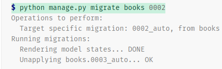

# dajnago_interview_preparation
Going deeper in my web developer skills

## Theorical Questions Section

### Theorical Question 1

Do you understand what a project is in django ?

<b>Answer</b>

A Python package – i.e. a directory of code – that contains all the settings for an instance of Django. This would include database configuration, Django-specific options and application-specific settings.

<b>Source</b>

https://docs.djangoproject.com/en/4.1/glossary/#term-project

### Theorical Question 2

Do you understand what manage.py script is for in django ?

<b>Answer</b>

A Python package – i.e. a directory of code – that contains all the settings for an instance of Django. This would include database configuration, Django-specific options and application-specific settings.

<b>Source</b>

https://docs.djangoproject.com/en/4.1/glossary/#term-project

### Theorical Question 3

Do you understand what migrations are in django ?

<b>Answer</b>

Migrations are Django’s way of propagating changes you make to your models (adding a field, deleting a model, etc.) into your database schema. They’re designed to be mostly automatic, but you’ll need to know when to make migrations, when to run them, and the common problems you might run into.

<b>Source</b>

https://docs.djangoproject.com/en/4.1/topics/migrations/

### Theorical Question 4

Do you understand what this command is doing in django ?

<b>Answer</b>

Migrations can be reversed with migrate by passing the number of the previous migration. For example, to reverse migration books.0003:

<b>Source</b>

https://docs.djangoproject.com/en/4.1/topics/migrations/

